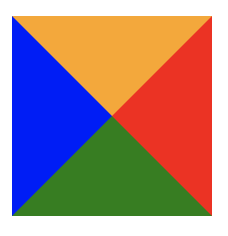

## 用 border 製作平行四邊形

### 原理
邊框的交界處產生斜角，必用交界處產生的斜角去做應用。

### border-color

border-color，依照順序是 上、右、下、左

```css
border-color: orange red green blue;
```



### index.html 的效果


### 參考資料
[使用 CSS border 製作梯形、三角形、對話框](http://www.smalljacky.com/web-design/css/css-border-create-triangle/)

[交大網路新生包](https://plus.nctu.edu.tw/newcomer/)